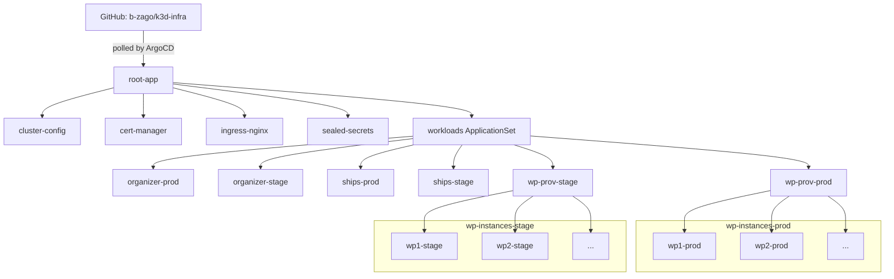

# k3d-infra

GitOps source of truth for my k3d cluster. ArgoCD watches this repo and reconciles the cluster to match it.

## How it works

Uses the **app-of-apps** pattern. A single root Application points at [apps/](apps/); every manifest in that directory is itself an ArgoCD Application (or ApplicationSet) that installs the next layer.

Push to `main` → ArgoCD notices → cluster converges. All Applications have `automated.prune` and `selfHeal` enabled.

## Layout

- [apps/root-app.yml](apps/root-app.yml) — the root Application; bootstrap this one manifest and it pulls in everything else.
- [apps/cluster-config.yml](apps/cluster-config.yml) — wraps [apps/cluster-config/](apps/cluster-config/): the Let's Encrypt `ClusterIssuer`, shared `ClusterRole`s, and the ArgoCD server Ingress.
- [apps/cert-manager.yml](apps/cert-manager.yml) — cert-manager from the Jetstack chart. Issues TLS certs for every ingress.
- [apps/ingress-nginx.yml](apps/ingress-nginx.yml) — ingress controller with SSL passthrough enabled (needed for the ArgoCD ingress).
- [apps/sealed-secrets.yml](apps/sealed-secrets.yml) — Bitnami sealed-secrets controller. Lets me commit encrypted secrets straight into this repo.
- [apps/workloads-applicationset.yml](apps/workloads-applicationset.yml) — an ApplicationSet with a matrix generator that crosses every directory in [apps/workloads/](apps/workloads/) with `{prod, stage}`, producing one Application per `(app, env)` pair.

## Workloads

Each subdirectory of [apps/workloads/](apps/workloads/) is a Helm chart. The ApplicationSet picks `values-prod.yml` or `values-stage.yml` per environment and deploys to a namespace named `<app>-<env>`.

- [organizer](apps/workloads/organizer/) — links organizer app (node server + Postgres).
- [ships](apps/workloads/ships/) — ships app (node server + Redis).
- [wp-prov](apps/workloads/wp-prov/) — WordPress provisioner dashboard. Uses [charts/wp-chart/](charts/wp-chart/) at runtime to spin up WordPress instances on demand.

## CI/CD

The `images.server` fields in each workload's `values-prod.yml` / `values-stage.yml` are updated by GitHub Actions in the upstream application repos. When an app repo builds a new image, its workflow bumps the tag here and commits — ArgoCD picks up the change and rolls out the new version.

## charts/wp-chart

Not deployed by ArgoCD. It's the template the `wp-prov` dashboard uses to provision ad-hoc WordPress instances at runtime.
