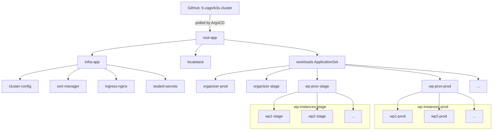

# k3s-cluster

GitOps source of truth for my k3s cluster. ArgoCD watches this repo and reconciles the cluster to match it.

## How it works

Uses the **app-of-apps** pattern. A single root Application points at [cluster/](cluster/); every manifest in that directory is itself an ArgoCD Application (or ApplicationSet) that installs the next layer.

Push to `main` → ArgoCD notices → cluster converges. All Applications have `automated.prune` and `selfHeal` enabled.

## Layout

- [cluster/root-app.yml](cluster/root-app.yml) — the root Application; bootstrap this one manifest and it pulls in everything else.
- [cluster/infra.yml](cluster/infra.yml) — wraps [cluster/infra/](cluster/infra/): cluster-config, cert-manager, ingress-nginx, and sealed-secrets.
- [cluster/localstack.yml](cluster/localstack.yml) — wraps [cluster/cloud/](cluster/cloud/): the LocalStack deployment plus its PVC and sealed auth secret.
- [cluster/workloads-appset.yml](cluster/workloads-appset.yml) — an ApplicationSet with a matrix generator that crosses every directory in [cluster/workloads/](cluster/workloads/) with `{prod, stage}`, producing one Application per `(app, env)` pair.

## Infra

- [cluster/infra/cluster-config.yml](cluster/infra/cluster-config.yml) — wraps [cluster/infra/cluster-config/](cluster/infra/cluster-config/): the Let's Encrypt `ClusterIssuer`, shared `ClusterRole`s, and the ArgoCD server Ingress.
- [cluster/infra/cert-manager.yml](cluster/infra/cert-manager.yml) — cert-manager from the Jetstack chart. Issues TLS certs for every ingress.
- [cluster/infra/ingress-nginx.yml](cluster/infra/ingress-nginx.yml) — ingress controller with SSL passthrough enabled (needed for the ArgoCD ingress).
- [cluster/infra/sealed-secrets.yml](cluster/infra/sealed-secrets.yml) — Bitnami sealed-secrets controller. Lets me commit encrypted secrets straight into this repo.

## Workloads

Each subdirectory of [cluster/workloads/](cluster/workloads/) is a Helm chart. The ApplicationSet picks `values-prod.yml` or `values-stage.yml` per environment and deploys to a namespace named `<app>-<env>`.

- [organizer](cluster/workloads/organizer/) — links organizer app (node server + Postgres).
- [ships](cluster/workloads/ships/) — ships app (node server + Redis).
- [portfolio](cluster/workloads/portfolio/) — portfolio site.
- [wp-prov](cluster/workloads/wp-prov/) — WordPress provisioner dashboard. Uses [charts/wp-chart/](charts/wp-chart/) at runtime to spin up WordPress instances on demand.

## Terraform

- [terraform/](terraform/) — defines all AWS resources emulated by LocalStack.

## CI/CD

The `images.server` fields in each workload's `values-prod.yml` / `values-stage.yml` are updated by GitHub Actions in the upstream application repos. When an app repo builds a new image, its workflow bumps the tag here and commits — ArgoCD picks up the change and rolls out the new version.

## charts/wp-chart

Not deployed by ArgoCD. It's the template the `wp-prov` dashboard uses to provision ad-hoc WordPress instances at runtime.
